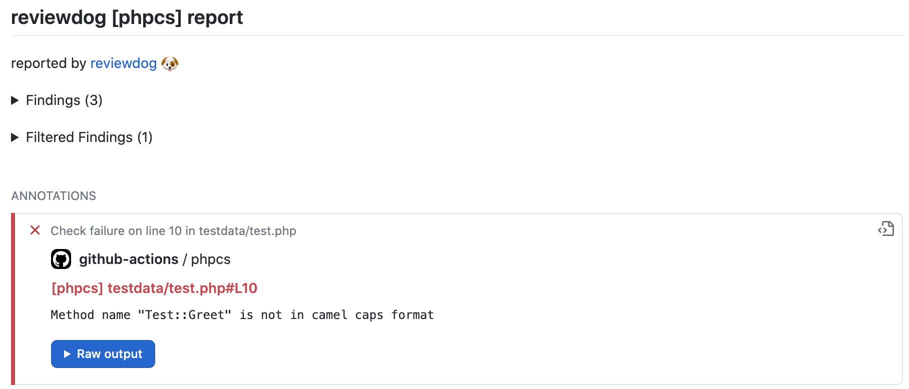
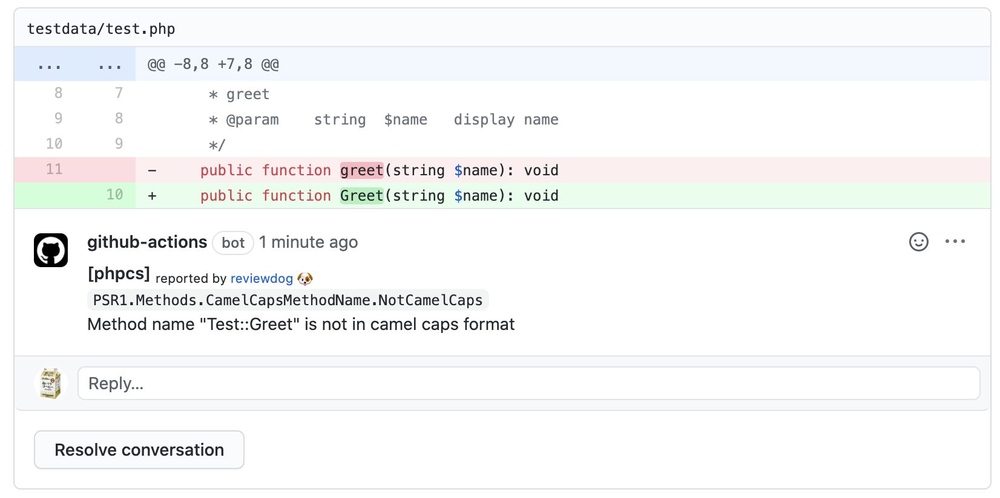

# GitHub Action: Run phpcs with reviewdog

[](https://github.com/shirobrak/action-phpcs/actions)

This action runs [phpcs](https://github.com/squizlabs/PHP_CodeSniffer) with [reviewdog](https://github.com/reviewdog/reviewdog) on pull requests to improve code review experience.




## Inputs

### `github_token`

**Required**. Default is `${{ github.token }}`.

### `level`

Optional. Report level for reviewdog [info,warning,error]. It's same as -level flag of reviewdog.

### `reporter`

Reporter of reviewdog command [github-pr-check,github-check,github-pr-review]. Default is github-pr-check. It's same as -reporter flag of reviewdog.

github-pr-review can use Markdown and add a link to rule page in reviewdog reports.

### `filter_mode`

Optional. Filtering mode for the reviewdog command [added,diff_context,file,nofilter]. Default is added.

### `fail_on_error`

Optional. Exit code for reviewdog when errors are found [true,false]. Default is false.

### `reviewdog_flags`

Optional. Additional reviewdog flags

### `phpcs_flags`

Optional. Flags and args of phpcs command. Default: '.'

### `workdir`

Optional. The directory from which to look for and run eslint. Default '.'

## Example usage

You also need to install [phpcs](https://github.com/squizlabs/PHP_CodeSniffer).

How to install phpcs is [here](https://github.com/squizlabs/PHP_CodeSniffer#installation).

### [.github/workflows/reviewdog.yaml](./.github/workflows/reviewdog.yaml)

```yaml
name: reviewdog
on: [pull_request]
jobs:
  phpcs:
    name: runner / phpcs
    runs-on: ubuntu-latest
    steps:
      - uses: actions/checkout@v2
      - name: phpcs
        uses: shirobrak/action-phpcs@v1.0.0
        with:
          github_token: ${{ secrets.GITHUB_TOKEN }}
          reporter: github-pr-review  # Change reporter.
          phpcs_flags: '--standard=phpcs.xml src/'
```